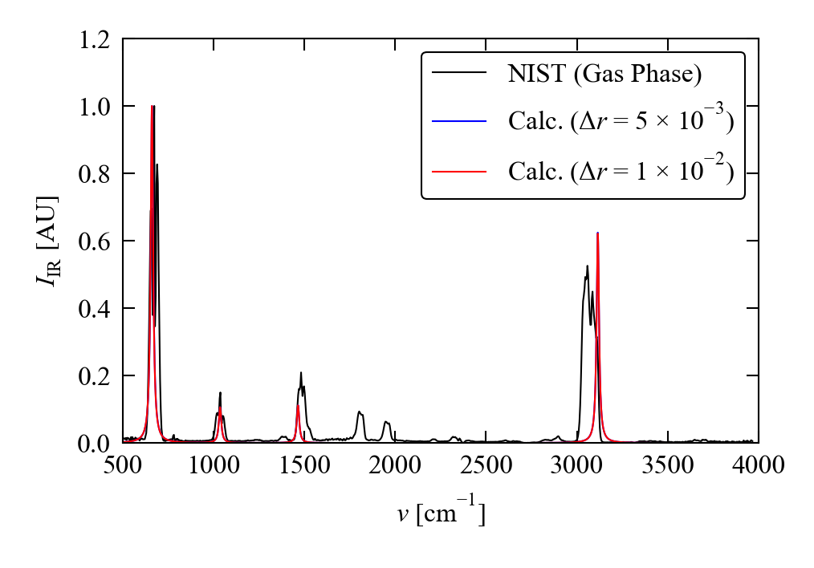
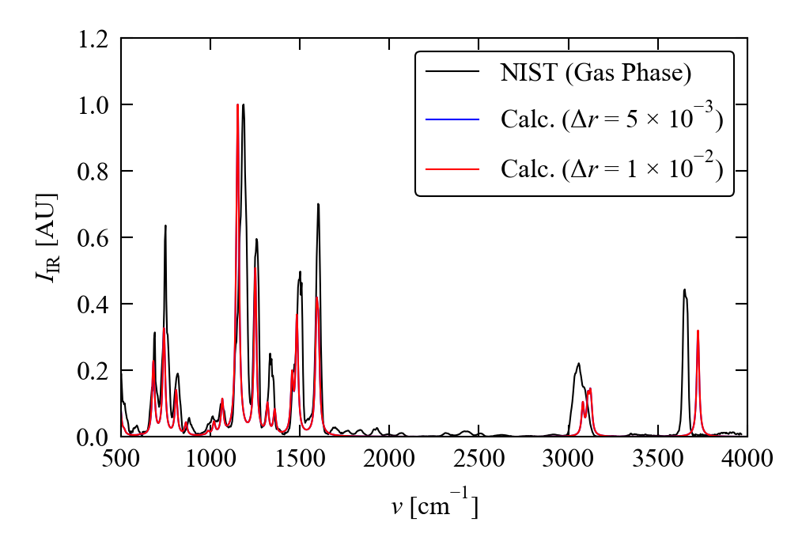
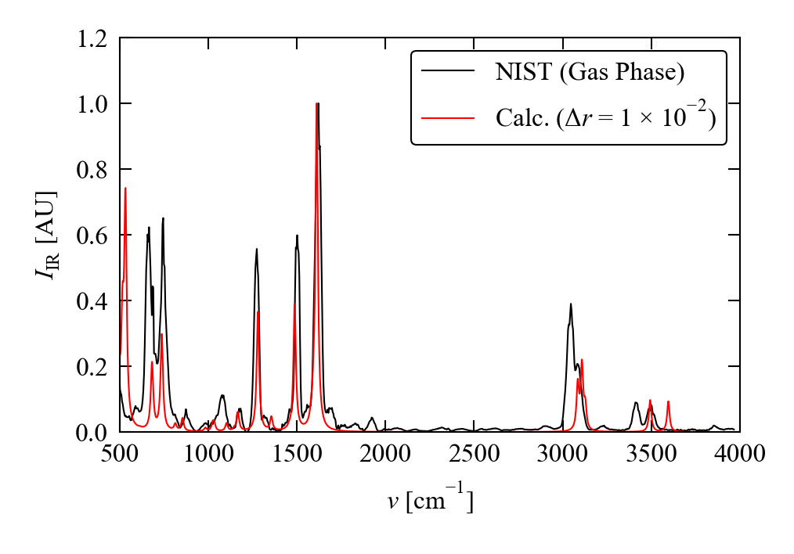
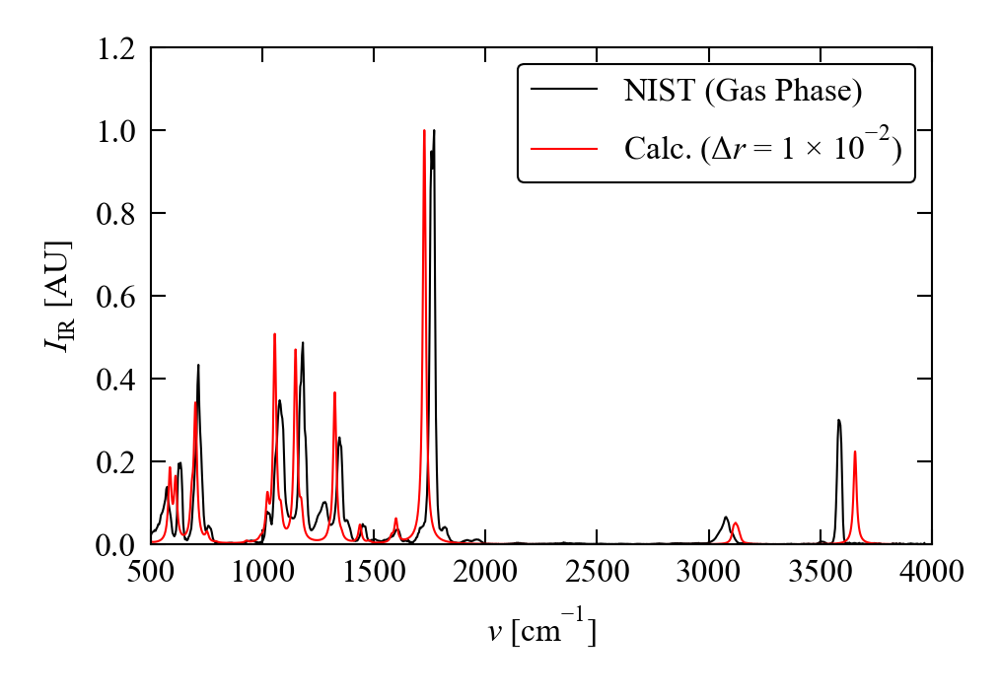
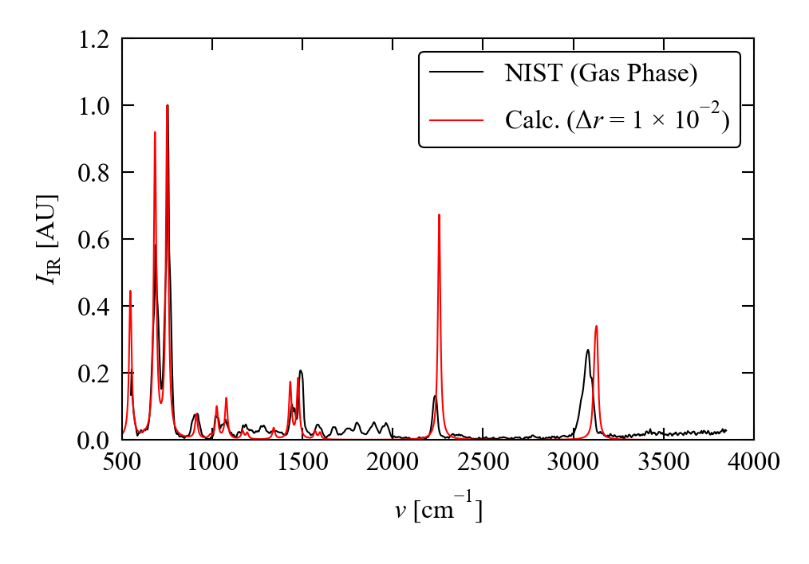

# Example: Benzene Derivatives

As a simple test of the infrared (IR) calculation routines, we compared simulated IR spectra of benzene and several derivatives to high-quality gas-phase spectra from the NIST Chemistry WebBook.[[1](#Ref1)]

## Calculations

For these calculations, we used Phonopy and VASP to prepare phonon frequencies/eigenvectors and Born effective-charge tensors, and post-processed using the `phonopy-ir` script.

Molecular models were prepared in Avogadro[[2](#Ref2)] and optimised in large periodic simulation cells with ~15 &#8491; between periodic images (built using the `xyz2poscar` script).

DFT calculations were performed with the dispersion-corrected PBE-D3 functional, an 800 eV plane-wave cutoff, and the "standard" H, C, N and O pseudopotentials (i.e. `POTCAR_H`, `POTCAR_C`, `POTCAR_N` and `POTCAR_O`) from the VASP 5.4 PAW dataset.

For the finite-displacement calculations with Phonopy, we used the default 1 &times; 10-2 &#8491; displacement step.
For a subset of the molecules we also tested a smaller 5 &times; 10-3 &#8491; step.
The Born effective-charge tensors were calculated using the DFPT routines in VASP (i.e. with the `LEPSILON` tag).

To prepare the phonon frequencies and eigenvectors:

1. Create displacements: `phonopy -d --dim="1 1 1"` (for a 5 &times; 10-3 &#8491; dispacement step, add `--amplitude=0.005`)

2. Run single-point force calculations (sample VASP input files in the [VASP-Files](./VASP-Files) folder)

3. Collect forces: `phonopy -f vasprun-{1..X}.xml`

4. Generate a `mesh.yaml` file with the &Gamma;-point phonon frequencies and 
eigenvectors: `phonopy --dim="1 1 1" --fc_symmetry=1 --mesh="1 1 1" --eigenvectors`

To prepare the Born effective-charge tensors:

1. Run a VASP DFPT calculation on the optimised structure to calculate the Born charges and dielectric tensor (sample VASP input files in [VASP-Files](./VASP-Files))

2. Create a `BORN` file using the Phonopy `outcar-born` script: `outcar-born > BORN`

Finally, to generate the spectrum:

1. Run `phonopy-ir` with a nominal spectral linewidth and spectrum range: `phonopy-ir --linewidth=16.5 --spectrum_range="500 4000"`

## Results

### Benzene

* Raw data: [Benzene](./Benzene); CAS/NIST database ID: 71-43-2

### Phenol

* Raw data: [Phenol](./Phenol); CAS/NIST database ID: 108-95-2

### Toluene

* Raw data: [Toluene](./Toluene); CAS/NIST database ID: 108-88-3

### Anisole

* Raw data: [Anisole](./Anisole); CAS/NIST database ID: 100-66-3

### Aniline

* Raw data: [Aniline](./Aniline); CAS/NIST database ID: 62-53-3

### Benzoic acid

* Raw data: [Benzoic acid](./Benzoic-Acid); CAS/NIST database ID: 65-85-0

### Benzaldehyde

* Raw data: [Benzaldehyde](./Benzaldehyde); CAS/NIST database ID: 100-52-7

### Benzonitrile

* Raw data: [Benzonitrile](./Benzonitrile); CAS/NIST database ID: 100-47-0

## References

1. [http://webbook.nist.gov/](http://webbook.nist.gov/)
2. [https://avogadro.cc/](https://avogadro.cc/)
