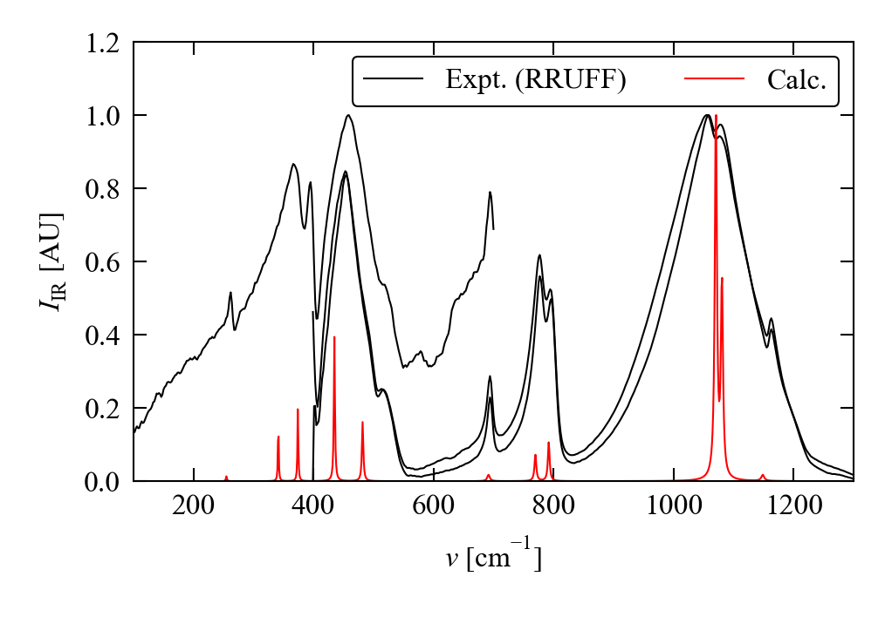
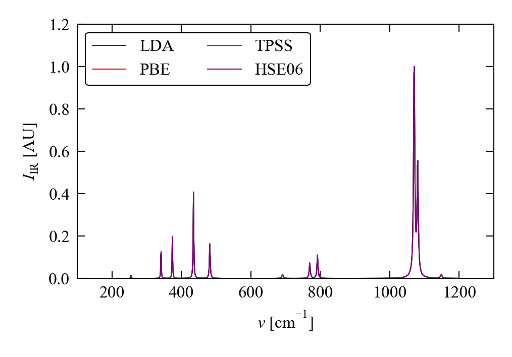
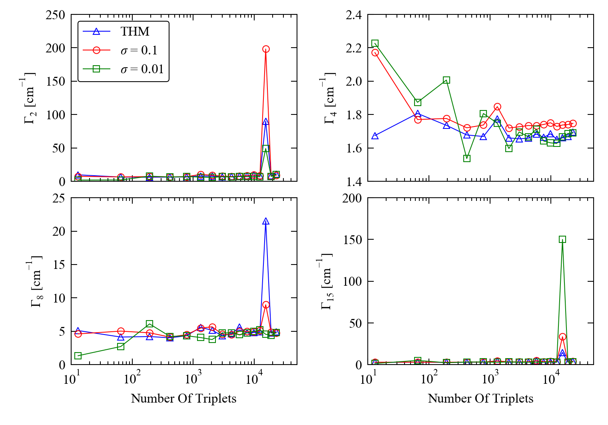
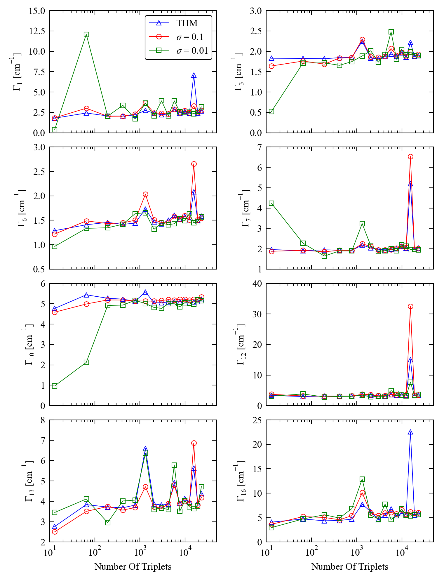

# Example: &alpha;-SiO2

In this example, we perform a detailed simulation of the infrared (IR) and Raman spectra of &alpha;-SiO2 (quartz) in the *P*3221 spacegroup. 

We calculate the band intensities, assign the modes to irreducible representations, and also include first-principles linewidths obtained from a high-quality Phono3py calculation.

We check the convergence of the calculated IR and Raman intensities with respect to the plane-wave cutoff, *k*-point sampling and exchange-correlation functional, and we also check the convergence of the linewidths with respect to *q*-point sampling and Brillouin-zone integration method.

The Phono(3)py calculations used as the base for this example were prepared by A. Togo.

## Calculations

### 1. Preparation

The input files generated from the Phono(3)py calculations are the structure (`POSCAR`), the second- and third-order force constants (`fc2.hdf5`, `fc3.hdf5`), and the Born effective-charge tensors (`BORN`).
For post-processing with `phonopy`, `fc2.hdf5` needs to be copied/renamed to `force_constants.hdf5`.

1. Generate a `mesh.yaml` file containing the &Gamma;-point phonon frequencies and eigenvectors: `phonopy --dim="6 6 3" --readfc --hdf5 --fc-symmetry --mesh="1 1 1" --eigenvectors`; for older versions of Phonopy, you may need to use `--fc_symmetry=1` in place of `--fc-symmetry`.

2. Generate an `irreps.yaml` file containing the grouping of the modes by Mulliken symbol: `phonopy --dim="6 6 3" --readfc --hdf5 --fc-symmetry --irreps="0 0 0"`.

3. Generate the phonon linewidths for the &Gamma;-point modes: `phono3py --dim="2 2 2" --dim_fc2="6 6 3" --fc2 --fc3 -v --br --thm --mesh="48 48 48" --write_gamma --gp=0`

### 2. IR spectrum

Using the `BORN` file provided with the calculaton, generate a simulated IR spectrum and peak table with the room-temperature (300 K) linewidths:

`phonopy-ir --ir-reps --linewidth-hdf5="kappa-m484848-g0.hdf5" --linewidth-temperature=300`

Sample VASP input files for calculating the Born charges - used for the convergence tests - can be found in the [VASP-Files](./VASP-Files) folder.

### 3. Raman spectrum

From the `irreps.yaml` file, and with reference to the character table for the D3 point group, the following modes may show Raman activity: 4-9, 11-15, 17, 18, 20-23, and 25-27.

1. Generate displaced structures for the Raman-intensity calculations: `phonopy-raman -d --bands="4 5 6 7 8 9 11 12 13 14 15 17 18 20 21 22 23 25 26 27"`

2. Run dielectric-constant calculations on the displaced structures (sample VASP input files in the [VASP-Files](./VASP-Files) folder).

3. Collect the dielectric constants calculated for the displaced structures: `phonopy-raman -r OUTCAR.*`

4. Post-process the results to generate a peak table and simulated Raman spectrum: `phonopy-raman -p --ir-reps --linewidth-hdf5="kappa-m484848-g0.hdf5" --linewidth-temperature=300`

## Results

### 1. IR spectrum

The simulated spectrum was compared to ATR-IR data from the RRUFF database (RRUFF IDs: R040031-1, R050125-1, R050125-1).

The calculations predict much sharper lines than in the three measurements.
However, given the much better reproduction of the linewidths of the Raman-active modes (see below), we believe this to be an experimental artefact.

There is also a slight shift in the peak positions, possibly due to the use of the LDA functional and/or the exclusion of finite-temperature effects from the calculations, but this is much less of an issue.

Nonetheless, the correspondance between the simulated and measured spectra is at least sufficient to assign the major bands.

### 2. Raman spectrum

The simulated spectrum was compared to depolarised 514 nm Raman spectra from the RRUFF database (RRUFF IDs: R040031-3, R050125-3, R060604-3).

Both the relative band intensities and peak widths are in excellent agreement with the experimental measurements, with the main discrepancies being in the two low-frequency bands below 250 cm-1.

As in the IR spectra, there are some noticeable shifts in band frequencies, but the correspondance is sufficient to assign the spectrum.

### 3. Peak table

The irreducible representation of the &Gamma;-point modes is obtained as 4 A1 + 4 A2 + 8 E.
From the character table, we expect the A1 modes to be Raman active, the A2 modes to be IR active, and the E modes to be both Raman and IR active.

<table>
	<tr>
		<th><i>&nu;</i> [cm-1]                                   </th>
		<th>Ir. Rep.                                                        </th>
		<th><i>I</i>IR [<i>e</i>2 amu-1]   </th>
		<th><i>I</i>Raman [<i>e</i>2 amu-1]</th>
		<th>&Gamma;<i>T</i>=300K [cm-1]               </th>
		<th><i>&rho;</i>                                                    </th>
	</tr>
	<tr>
		<td>       127.37</td>
		<td>E            </td>
		<td>        0.000</td>
		<td>        0.834</td>
		<td>         2.63</td>
		<td>         0.75</td>
	</tr>
	<tr>
		<td>       223.52</td>
		<td>A1</td>
		<td>Inactive     </td>
		<td>        6.930</td>
		<td>         9.52</td>
		<td>         0.00</td>
	</tr>
	<tr>
		<td>       255.08</td>
		<td>E            </td>
		<td>        0.021</td>
		<td>        0.404</td>
		<td>         1.96</td>
		<td>         0.75</td>
	</tr>
	<tr>
		<td>       337.02</td>
		<td>A1</td>
		<td>Inactive     </td>
		<td>        1.057</td>
		<td>         1.69</td>
		<td>         0.42</td>
	</tr>
	<tr>
		<td>       341.54</td>
		<td>A2</td>
		<td>        0.202</td>
		<td>Inactive     </td>
		<td>         1.44</td>
		<td>-            </td>
	</tr>
	<tr>
		<td>       374.19</td>
		<td>E            </td>
		<td>        0.268</td>
		<td>        0.624</td>
		<td>         1.58</td>
		<td>         0.75</td>
	</tr>
	<tr>
		<td>       434.99</td>
		<td>E            </td>
		<td>        0.685</td>
		<td>        0.718</td>
		<td>         2.13</td>
		<td>         0.75</td>
	</tr>
	<tr>
		<td>       454.96</td>
		<td>A1</td>
		<td>Inactive     </td>
		<td>       35.085</td>
		<td>         4.83</td>
		<td>         0.00</td>
	</tr>
	<tr>
		<td>       482.03</td>
		<td>A2</td>
		<td>        0.362</td>
		<td>Inactive     </td>
		<td>         2.75</td>
		<td>-            </td>
	</tr>
	<tr>
		<td>       691.77</td>
		<td>E            </td>
		<td>        0.074</td>
		<td>        1.359</td>
		<td>         5.15</td>
		<td>         0.75</td>
	</tr>
	<tr>
		<td>       769.87</td>
		<td>A2</td>
		<td>        0.213</td>
		<td>Inactive     </td>
		<td>         3.63</td>
		<td>-            </td>
	</tr>
	<tr>
		<td>       792.15</td>
		<td>E            </td>
		<td>        0.298</td>
		<td>        1.554</td>
		<td>         3.43</td>
		<td>         0.75</td>
	</tr>
	<tr>
		<td>      1070.57</td>
		<td>E            </td>
		<td>        3.441</td>
		<td>        1.366</td>
		<td>         4.15</td>
		<td>         0.75</td>
	</tr>
	<tr>
		<td>      1080.66</td>
		<td>A2</td>
		<td>        1.804</td>
		<td>Inactive     </td>
		<td>         4.17</td>
		<td>-            </td>
	</tr>
	<tr>
		<td>      1085.88</td>
		<td>A1</td>
		<td>Inactive     </td>
		<td>        1.113</td>
		<td>         3.56</td>
		<td>         0.72</td>
	</tr>
	<tr>
		<td>      1148.71</td>
		<td>E            </td>
		<td>        0.078</td>
		<td>        2.811</td>
		<td>         5.85</td>
		<td>         0.75</td>
	</tr>
</table>

## Some convergence checks

### 1. IR intensities

A set of Born effective charges were calculated using LDA as part of the Phono(3)py calculation.
We further checked the convergence of the calculated IR intensities with respect to the plane-wave cutoff and *k*-point sampling used to calculate the charges, and we also tested the effect of using DFT functionals at different levels of approximation.

#### a. Plane-wave cutoff and *k*-point sampling

Cutoff and *k*-point tests were performed from a baseline of a 520 eV cutoff and a 6&times;6&times;6 &Gamma;-centred mesh, which are the settings used for this compound in the Materials Project database (mp-6930).[1]
Sample VASP input files for each parameter set can be found in the [VASP-Files](./VASP-Files) folder.

<table>
	<tr>
		<th>#              </th>
		<th>Cutoff [eV]    </th>
		<th><i>k</i>-points</th>
	</tr>
	<tr> <td>-</td> <td>Togo</td> <td>Togo                </td> </tr>
	<tr> <td>1</td> <td> 520</td> <td>6&times;6&times;6   </td> </tr>
	<tr> <td>2</td> <td> 600</td> <td>6&times;6&times;6   </td> </tr>
	<tr> <td>3</td> <td> 700</td> <td>6&times;6&times;6   </td> </tr>
	<tr> <td>4</td> <td> 800</td> <td>6&times;6&times;6   </td> </tr>
	<tr> <td>5</td> <td> 600</td> <td>8&times;8&times;8   </td> </tr>
	<tr> <td>6</td> <td> 600</td> <td>10&times;10&times;10</td> </tr>
	<tr> <td>7</td> <td> 600</td> <td>12&times;12&times;12</td> </tr>
</table>

In this case, we observed negligable quantitative variation in the calculated intensities on either increasing the plane-wave cutoff or using denser *k*-point sampling.
This is most likely because a) the baseline calculation is well converged, and b) SiO2 is an insulator, and as such does not require a dense sampling mesh.

<table>
	<tr>
		<th rowspan="2"><i>&nu;</i> [cm-1]                                </th>
		<th rowspan="2">Ir. Rep.                                                     </th>
		<th colspan="8"><i>I</i>IR [<i>e</i>2 amu-1]</th>
	</tr>
	<tr>
		<th>-</th>
		<th>1</th>
		<th>2</th>
		<th>3</th>
		<th>4</th>
		<th>5</th>
		<th>6</th>
		<th>7</th>
	</tr>
	<tr>
		<td>           127.37</td>
		<td>E                </td>
		<td>< 10-3</td>
		<td>< 10-3</td>
		<td>< 10-3</td>
		<td>< 10-3</td>
		<td>< 10-3</td>
		<td>< 10-3</td>
		<td>< 10-3</td>
		<td>< 10-3</td>
	</tr>
	<tr>
		<td>           255.08</td>
		<td>E                </td>
		<td>            0.021</td>
		<td>            0.021</td>
		<td>            0.021</td>
		<td>            0.021</td>
		<td>            0.021</td>
		<td>            0.021</td>
		<td>            0.021</td>
		<td>            0.021</td>
	</tr>
	<tr>
		<td>           341.54</td>
		<td>A2    </td>
		<td>            0.202</td>
		<td>            0.202</td>
		<td>            0.202</td>
		<td>            0.202</td>
		<td>            0.202</td>
		<td>            0.202</td>
		<td>            0.202</td>
		<td>            0.202</td>
	</tr>
	<tr>
		<td>           374.19</td>
		<td>E                </td>
		<td>            0.268</td>
		<td>            0.268</td>
		<td>            0.268</td>
		<td>            0.268</td>
		<td>            0.268</td>
		<td>            0.268</td>
		<td>            0.268</td>
		<td>            0.268</td>
	</tr>
	<tr>
		<td>           434.99</td>
		<td>E                </td>
		<td>            0.685</td>
		<td>            0.685</td>
		<td>            0.685</td>
		<td>            0.685</td>
		<td>            0.685</td>
		<td>            0.685</td>
		<td>            0.685</td>
		<td>            0.685</td>
	</tr>
	<tr>
		<td>           482.03</td>
		<td>A2    </td>
		<td>            0.362</td>
		<td>            0.362</td>
		<td>            0.362</td>
		<td>            0.362</td>
		<td>            0.362</td>
		<td>            0.362</td>
		<td>            0.362</td>
		<td>            0.362</td>
	</tr>
	<tr>
		<td>           691.77</td>
		<td>E                </td>
		<td>            0.074</td>
		<td>            0.074</td>
		<td>            0.074</td>
		<td>            0.074</td>
		<td>            0.074</td>
		<td>            0.074</td>
		<td>            0.074</td>
		<td>            0.074</td>
	</tr>
	<tr>
		<td>           769.87</td>
		<td>A2    </td>
		<td>            0.213</td>
		<td>            0.213</td>
		<td>            0.213</td>
		<td>            0.213</td>
		<td>            0.213</td>
		<td>            0.213</td>
		<td>            0.213</td>
		<td>            0.213</td>
	</tr>
	<tr>
		<td>           792.15</td>
		<td>E                </td>
		<td>            0.298</td>
		<td>            0.298</td>
		<td>            0.298</td>
		<td>            0.298</td>
		<td>            0.298</td>
		<td>            0.298</td>
		<td>            0.298</td>
		<td>            0.298</td>
	</tr>
	<tr>
		<td>          1070.57</td>
		<td>E                </td>
		<td>            3.441</td>
		<td>            3.442</td>
		<td>            3.441</td>
		<td>            3.440</td>
		<td>            3.440</td>
		<td>            3.441</td>
		<td>            3.441</td>
		<td>            3.441</td>
	</tr>
	<tr>
		<td>          1080.66</td>
		<td>A2    </td>
		<td>            1.804</td>
		<td>            1.804</td>
		<td>            1.804</td>
		<td>            1.803</td>
		<td>            1.803</td>
		<td>            1.804</td>
		<td>            1.804</td>
		<td>            1.804</td>
	</tr>
	<tr>
		<td>          1148.71</td>
		<td>E                </td>
		<td>            0.078</td>
		<td>            0.078</td>
		<td>            0.078</td>
		<td>            0.078</td>
		<td>            0.078</td>
		<td>            0.078</td>
		<td>            0.078</td>
		<td>            0.078</td>
	</tr>
</table>

### b. Effect of functional

To test the effect of using different exchange-correlation functionals to calculate the Born charges, we compared the intensities obtained from one of the LDA calculations (600 eV cutoff with a 6&times;6&times;6 *k*-point mesh) to those calculated using the PBE GGA and TPSS meta-GGA functionals with equivalent settings.

We also performed calculations using the HSE06 hybrid functional with a relaxed 4&times;4&times;4 *k*-point mesh and a reduced total-energy convergence criteria of 10-6 eV (vs. the usual 10-8 eV).

Sample VASP input files for these tests can be found in the [VASP-Files](./VASP-Files) directory.

Again, we observed very little quantitative difference in the calculated intensities of the IR-active modes.
We note, of course, that different exchange-correlation functionals would very likely have a more significant impact on other parts of the calculation (e.g. the calculation of the phonon frequencies and/or linewidths).

<table>
	<tr>
		<th rowspan="2"><i>&nu;</i> [cm-1]                                </th>
		<th rowspan="2">Ir. Rep.                                                     </th>
		<th colspan="4"><i>I</i>IR [<i>e</i>2 amu-1]</th>
		<!-- Merged cell -->
		<!-- Merged cell -->
		<!-- Merged cell -->
	</tr>
	<tr>
		<!-- Merged cell -->
		<!-- Merged cell -->
		<th>LDA                 </th>
		<th>PBE                 </th>
		<th>TPSS*               </th>
		<th>HSE06*,**</th>
	</tr>
	<tr>
	<tr>
		<td>           127.37</td>
		<td>E                </td>
		<td>< 10-3</td>
		<td>< 10-3</td>
		<td>< 10-3</td>
		<td>< 10-3</td>
	</tr>
	<tr>
		<td>           255.08</td>
		<td>E                </td>
		<td>            0.021</td>
		<td>            0.021</td>
		<td>            0.021</td>
		<td>            0.023</td>
	</tr>
	<tr>
		<td>           341.54</td>
		<td>A2    </td>
		<td>            0.202</td>
		<td>            0.200</td>
		<td>            0.199</td>
		<td>            0.208</td>
	</tr>
	<tr>
		<td>           374.19</td>
		<td>E                </td>
		<td>            0.268</td>
		<td>            0.265</td>
		<td>            0.266</td>
		<td>            0.269</td>
	</tr>
	<tr>
		<td>           434.99</td>
		<td>E                </td>
		<td>            0.685</td>
		<td>            0.678</td>
		<td>            0.680</td>
		<td>            0.705</td>
	</tr>
	<tr>
		<td>           482.03</td>
		<td>A2    </td>
		<td>            0.362</td>
		<td>            0.359</td>
		<td>            0.360</td>
		<td>            0.367</td>
	</tr>
	<tr>
		<td>           691.77</td>
		<td>E                </td>
		<td>            0.074</td>
		<td>            0.072</td>
		<td>            0.073</td>
		<td>            0.075</td>
	</tr>
	<tr>
		<td>           769.87</td>
		<td>A2    </td>
		<td>            0.213</td>
		<td>            0.209</td>
		<td>            0.210</td>
		<td>            0.215</td>
	</tr>
	<tr>
		<td>           792.15</td>
		<td>E                </td>
		<td>            0.298</td>
		<td>            0.293</td>
		<td>            0.293</td>
		<td>            0.309</td>
	</tr>
	<tr>
		<td>          1070.57</td>
		<td>E                </td>
		<td>            3.441</td>
		<td>            3.453</td>
		<td>            3.488</td>
		<td>            3.418</td>
	</tr>
	<tr>
		<td>          1080.66</td>
		<td>A2    </td>
		<td>            1.804</td>
		<td>            1.811</td>
		<td>            1.829</td>
		<td>            1.790</td>
	</tr>
	<tr>
		<td>          1148.71</td>
		<td>E                </td>
		<td>            0.078</td>
		<td>            0.077</td>
		<td>            0.078</td>
		<td>            0.079</td>
	</tr>
</table>

\* These calculations were performed using the finite-field method (`LCALCEPS = .TRUE.` in VASP) with the default applied field of 10-2 eV &Aring;-1
 
\** As noted above, for the HSE06 hybrid calculations, the *k*-point mesh was reduced to 4&times;4&times;4 subdivisions for computational efficiency

### 2. Raman intensities

As for the IR intensities, we checked the convergence of the calculated Raman intensities with respect to the plane-wave cutoff and *k*-point sampling by performing tests with a subset of the parameters employed in the previous section (the same VASP input deck is used for calculating &epsilon;static and the Born effective-charge tensors; sample input files are in the [VASP-Files](./VASP-Files) folder).

<table>
	<tr>
		<th>#              </th>
		<th>Cutoff [eV]    </th>
		<th><i>k</i>-points</th>
	</tr>
	<tr> <td>1</td> <td>520</td> <td>6&times;6&times;6   </td> </tr>
	<tr> <td>2</td> <td>600</td> <td>6&times;6&times;6   </td> </tr>
	<tr> <td>5</td> <td>600</td> <td>8&times;8&times;8   </td> </tr>
	<tr> <td>6</td> <td>600</td> <td>10&times;10&times;10</td> </tr>
	<tr> <td>7</td> <td>600</td> <td>12&times;12&times;12</td> </tr>
</table>

We again observed no significant variation in the calculated intensities, and therefore opted to use the base parameters (520 eV cutoff with 6&times;6&times;6 *k*-point sampling) for the "production" simulated spectrum.

We stress again, however, that the weak dependence of the calculated intensities on the technical parameters, in particular the *k*-point sampling, may be due to the insulating nature of &alpha;-SiO2.

<table>
	<tr>
		<th rowspan="2"><i>&nu;</i> [cm-1]                                  </th>
		<th rowspan="2">Ir. Rep.                                                       </th>
		<th colspan="5"><i>I</i>Raman [&Aring;4 amu-1]</th>
		<!-- Merged cell -->
		<!-- Merged cell -->
		<!-- Merged cell -->
		<!-- Merged cell -->
	</tr>
	<tr>
		<!-- Merged cell -->
		<!-- Merged cell -->
		<th>1</th>
		<th>2</th>
		<th>5</th>
		<th>6</th>
		<th>7</th>
	</tr>
	<tr>
		<td>       127.37</td>
		<td>E            </td>
		<td>        0.834</td>
		<td>        0.834</td>
		<td>        0.834</td>
		<td>        0.834</td>
		<td>        0.834</td>
	</tr>
	<tr>
		<td>       223.52</td>
		<td>A1</td>
		<td>        6.931</td>
		<td>        6.928</td>
		<td>        6.928</td>
		<td>        6.928</td>
		<td>        6.928</td>
	</tr>
	<tr>
		<td>       255.08</td>
		<td>E            </td>
		<td>        0.404</td>
		<td>        0.403</td>
		<td>        0.403</td>
		<td>        0.403</td>
		<td>        0.403</td>
	</tr>
	<tr>
		<td>       337.02</td>
		<td>A1</td>
		<td>        1.057</td>
		<td>        1.056</td>
		<td>        1.055</td>
		<td>        1.056</td>
		<td>        1.056</td>
	</tr>
	<tr>
		<td>       374.19</td>
		<td>E            </td>
		<td>        0.624</td>
		<td>        0.623</td>
		<td>        0.624</td>
		<td>        0.623</td>
		<td>        0.623</td>
	</tr>
	<tr>
		<td>       434.99</td>
		<td>E            </td>
		<td>        0.718</td>
		<td>        0.718</td>
		<td>        0.717</td>
		<td>        0.717</td>
		<td>        0.717</td>
	</tr>
	<tr>
		<td>       454.96</td>
		<td>A1</td>
		<td>       35.085</td>
		<td>       35.090</td>
		<td>       35.096</td>
		<td>       35.093</td>
		<td>       35.099</td>
	</tr>
	<tr>
		<td>       691.77</td>
		<td>E            </td>
		<td>        1.359</td>
		<td>        1.359</td>
		<td>        1.358</td>
		<td>        1.359</td>
		<td>        1.359</td>
	</tr>
	<tr>
		<td>       792.15</td>
		<td>E            </td>
		<td>        1.554</td>
		<td>        1.556</td>
		<td>        1.556</td>
		<td>        1.556</td>
		<td>        1.556</td>
	</tr>
	<tr>
		<td>      1070.57</td>
		<td>E            </td>
		<td>        1.366</td>
		<td>        1.365</td>
		<td>        1.365</td>
		<td>        1.366</td>
		<td>        1.366</td>
	</tr>
	<tr>
		<td>      1085.88</td>
		<td>A1</td>
		<td>        1.113</td>
		<td>        1.113</td>
		<td>        1.112</td>
		<td>        1.113</td>
		<td>        1.113</td>
	</tr>
	<tr>
		<td>      1148.71</td>
		<td>E            </td>
		<td>        2.811</td>
		<td>        2.810</td>
		<td>        2.810</td>
		<td>        2.810</td>
		<td>        2.810</td>
	</tr>
</table>

### 3. Mode linewidths

Finally, we also checked the convergence of the &Gamma;-point linewidths with respect to the isotropic *q*-point grid and integration method used to evaluate the three-phonon interaction strengths during the Phono3py post processing.

We tested three different integration methods, *viz.* the tetrahedron method (THM) and Gaussian smearing with &sigma; = 0.1 and 0.01 THz.
The tetrahedron method and Gaussian smearing with &sigma; = 0.1 THz give broadly similar results, whereas for most of the modes the convergence with the Gaussian smearing using &sigma; = 0.01 THz is erratic, particularly at sparser *q*-point grids.

In this particular set of calculations, *q*-point meshes with 56&times;56&times;56 subdivisions (1.55 &times; 104 triplets) led to an anomalous spike in the calculated linewidths, indicating that explicit convergence testing ought to be considered a necessity.

In the present case, the tetrahedron method and a *q*-point sampling of 48&times;48&times;48 subdivisions (9.84 &times; 103 triplets) appears to give well-converged results, so we employed these settings to obtain the linewidths used to generate the simulated spectra.

#### a. A1 modes

#### b. A2 modes

#### c. E modes

## References

1. [https://materialsproject.org/materials/mp-6930/](https://materialsproject.org/materials/mp-6930/)